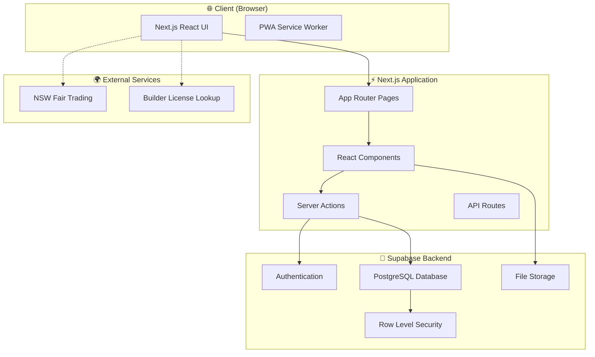
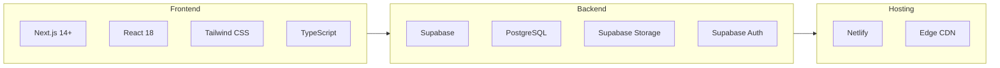
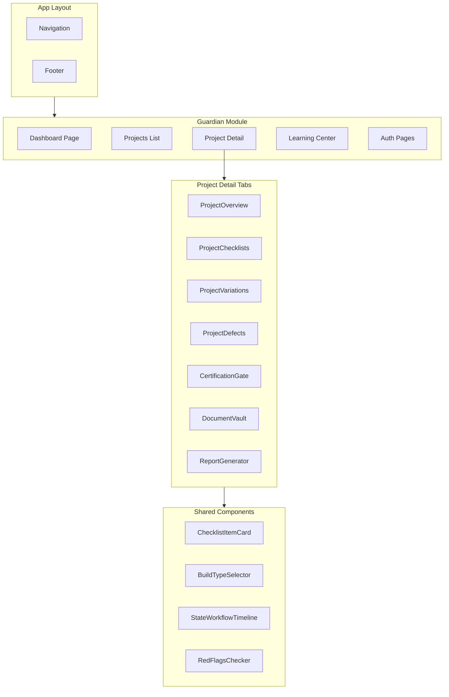
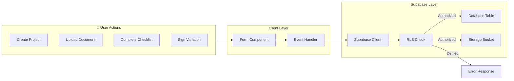
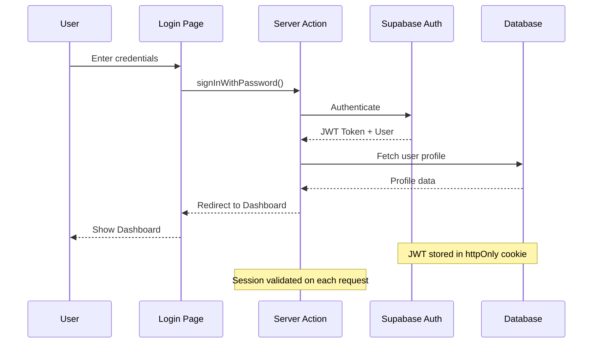
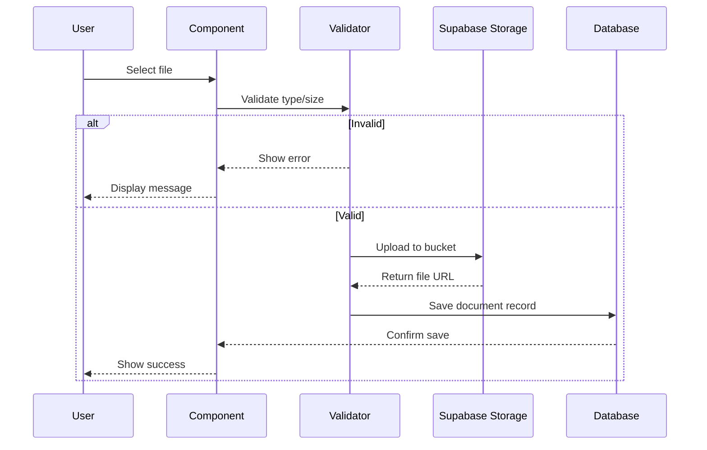

# HomeOwner Guardian - System Architecture

## Overview

HomeOwner Guardian is a Next.js application that helps Australian homeowners track their building projects, protect against unethical builder practices, and prepare for Fair Trading disputes if needed.

---

## High-Level Architecture



---

## Technology Stack



---

## Component Architecture



---

## Data Flow Architecture



---

## Authentication Flow



---

## File Upload Security Flow



---

## Deployment Architecture

```mermaid
flowchart TB
    subgraph Dev["Development"]
        Local["localhost:3007"]
        MockDB["Mock Supabase Client"]
        DevCookie["dev_mode Cookie"]
    end
    
    subgraph Staging["Staging"]
        NetlifyPreview["Netlify Preview"]
        SupabaseStaging["Supabase Staging"]
    end
    
    subgraph Production["Production"]
        NetlifyProd["Netlify Production"]
        SupabaseProd["Supabase Production"]
        CustomDomain["Custom Domain"]
    end
    
    Dev -->|PR Push| Staging
    Staging -->|Merge to main| Production
    
    Note over Dev: NODE_ENV=development
    Note over Production: NODE_ENV=production
```
