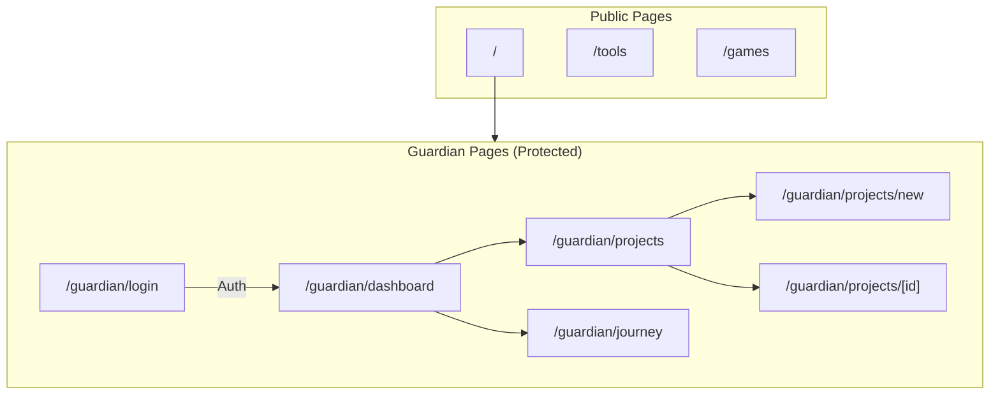
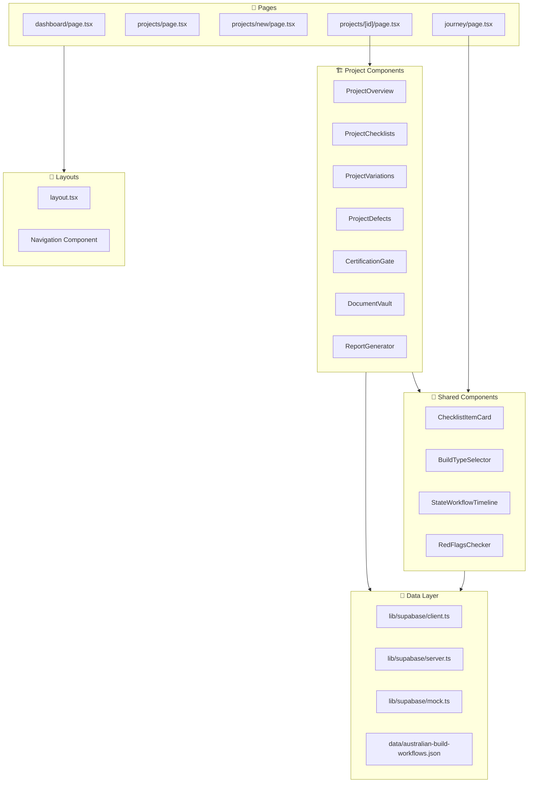
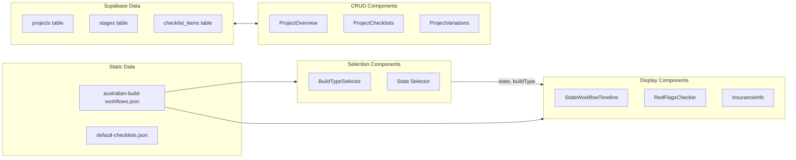
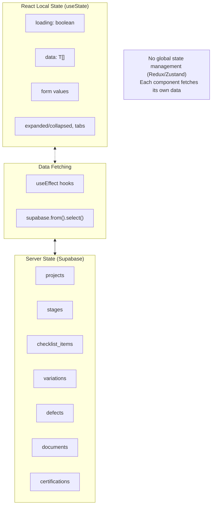

# HomeOwner Guardian - Component Map

## Page Structure



---

## Component Hierarchy



---

## Component Details

### Page Components

| Component | Path | Purpose |
|-----------|------|---------|
| `DashboardPage` | `/guardian/dashboard` | Overview stats, project summary |
| `ProjectsPage` | `/guardian/projects` | List all projects |
| `NewProjectPage` | `/guardian/projects/new` | 2-step project creation wizard |
| `ProjectDetailPage` | `/guardian/projects/[id]` | 7-tab project management |
| `JourneyPage` | `/guardian/journey` | Learning center with state selector |
| `LoginPage` | `/guardian/login` | Auth with dev mode option |

### Project Tab Components

| Component | Tab | Key Features |
|-----------|-----|--------------|
| `ProjectOverview` | Overview | Financial stats, construction timeline, builder info |
| `ProjectChecklists` | Checklists | Stage-based items, photo evidence, completion tracking |
| `ProjectVariations` | Variations | Cost tracking, threshold alerts, digital signatures |
| `ProjectDefects` | Defects | Issue logging, severity levels, photo evidence |
| `CertificationGate` | Certificates | Payment blocking, mandatory certs list |
| `DocumentVault` | Documents | 12 doc types, required tracking, file upload |
| `ReportGenerator` | Reports | 4 report types, Fair Trading template |

### Shared Components

| Component | Used By | Purpose |
|-----------|---------|---------|
| `ChecklistItemCard` | ProjectChecklists | Interactive checklist with photo upload |
| `BuildTypeSelector` | NewProjectPage | State & build category selection |
| `StateWorkflowTimeline` | JourneyPage | Construction stages with warnings |
| `RedFlagsChecker` | JourneyPage | Phase-specific builder warnings |

---

## Data Flow Between Components



---

## State Management



---

## File Structure

```
vedawell-next/
├── src/
│   ├── app/
│   │   ├── guardian/
│   │   │   ├── dashboard/
│   │   │   │   └── page.tsx
│   │   │   ├── projects/
│   │   │   │   ├── page.tsx          # List
│   │   │   │   ├── new/
│   │   │   │   │   └── page.tsx      # Create
│   │   │   │   └── [id]/
│   │   │   │       └── page.tsx      # Detail
│   │   │   ├── journey/
│   │   │   │   └── page.tsx          # Learning
│   │   │   └── login/
│   │   │       ├── page.tsx
│   │   │       └── actions.ts
│   │   └── layout.tsx
│   │
│   ├── components/
│   │   └── guardian/
│   │       ├── ProjectOverview.tsx
│   │       ├── ProjectChecklists.tsx
│   │       ├── ProjectVariations.tsx
│   │       ├── ProjectDefects.tsx
│   │       ├── CertificationGate.tsx
│   │       ├── DocumentVault.tsx
│   │       ├── ReportGenerator.tsx
│   │       ├── ChecklistItemCard.tsx
│   │       ├── BuildTypeSelector.tsx
│   │       ├── StateWorkflowTimeline.tsx
│   │       ├── RedFlagsChecker.tsx
│   │       └── BuildJourneyTimeline.tsx
│   │
│   ├── data/
│   │   ├── australian-build-workflows.json
│   │   └── default-checklists.json
│   │
│   └── lib/
│       └── supabase/
│           ├── client.ts
│           ├── server.ts
│           └── mock.ts
│
├── supabase/
│   ├── schema.sql
│   └── schema_v2.sql
│
└── docs/
    ├── architecture.md
    ├── database-schema.md
    ├── user-workflows.md
    └── component-map.md
```
