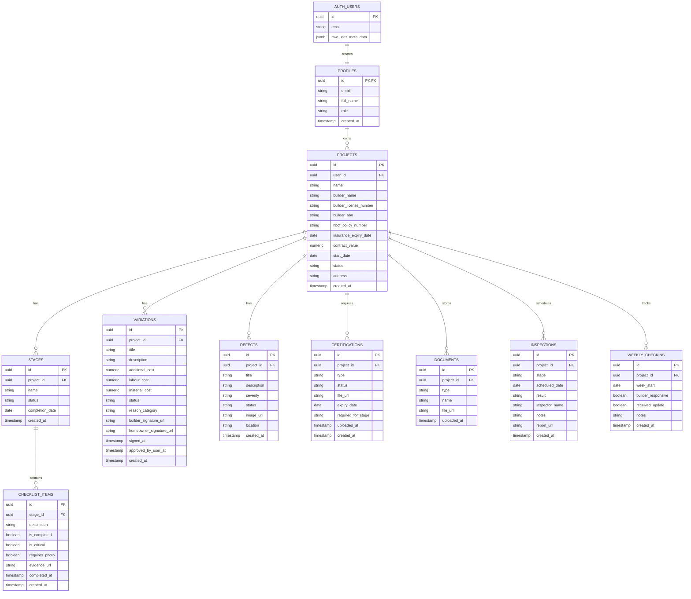
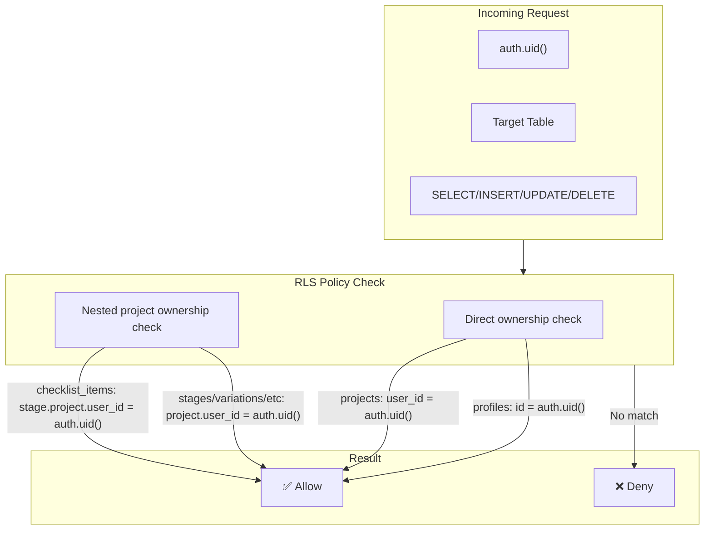

# HomeOwner Guardian - Database Schema

## Entity Relationship Diagram

---

## Table Relationships Summary

| Parent | Child | Relationship | Cascade Delete |
|--------|-------|--------------|----------------|
| auth.users | profiles | 1:1 | - |
| profiles | projects | 1:N | No |
| projects | stages | 1:N | Yes |
| projects | variations | 1:N | Yes |
| projects | defects | 1:N | Yes |
| projects | certifications | 1:N | Yes |
| projects | documents | 1:N | Yes |
| projects | inspections | 1:N | Yes |
| projects | weekly_checkins | 1:N | Yes |
| stages | checklist_items | 1:N | Yes |

---

## Row Level Security (RLS) Policies

---

## Status Enums

### Project Status
| Value | Description |
|-------|-------------|
| `planning` | Initial planning phase |
| `active` | Construction in progress |
| `completed` | Build finished |
| `paused` | Temporarily on hold |

### Stage Status
| Value | Description |
|-------|-------------|
| `pending` | Not started |
| `in_progress` | Currently underway |
| `completed` | Work finished |
| `verified` | Inspected and approved |

### Variation Status
| Value | Description |
|-------|-------------|
| `draft` | Being prepared |
| `sent` | Sent to homeowner |
| `approved` | Homeowner approved |
| `rejected` | Homeowner rejected |

### Defect Severity
| Value | Description |
|-------|-------------|
| `minor` | Cosmetic issues |
| `major` | Functional problems |
| `critical` | Safety concerns |

### Certification Status
| Value | Description |
|-------|-------------|
| `pending` | Not yet provided |
| `uploaded` | File uploaded |
| `verified` | Confirmed valid |
| `expired` | Past expiry date |
