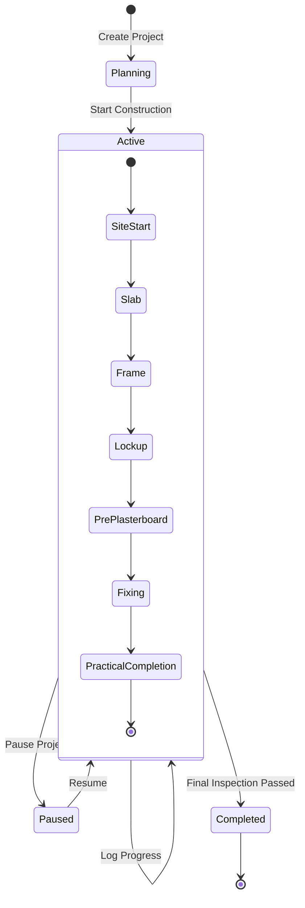
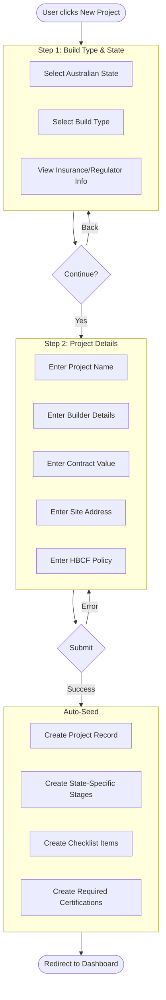
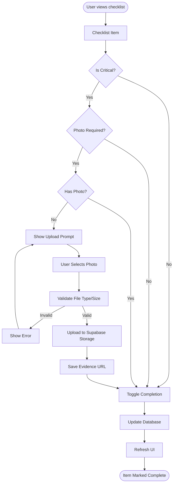
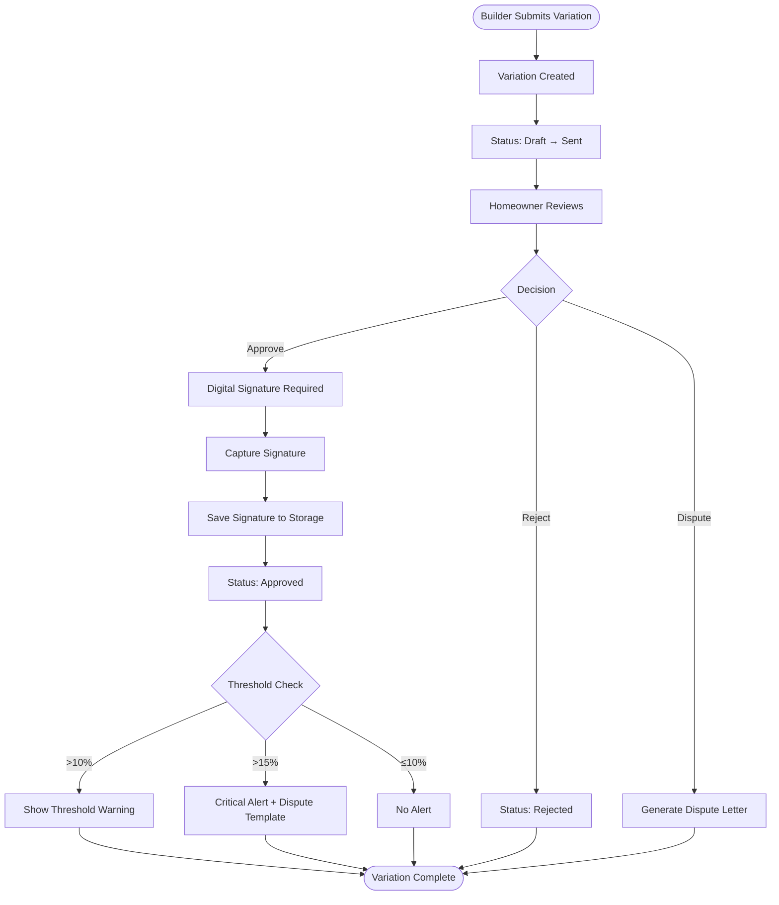
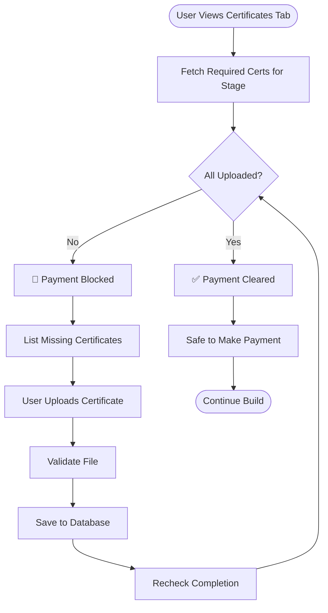
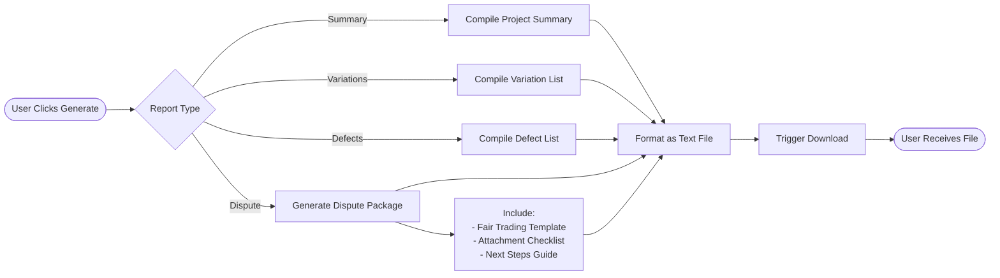
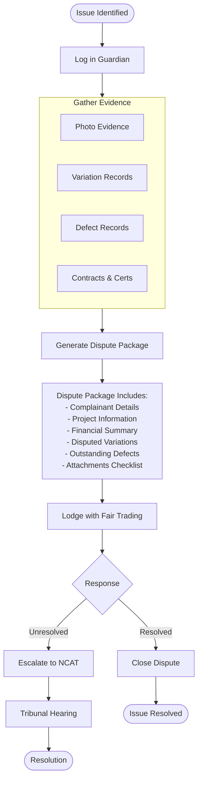
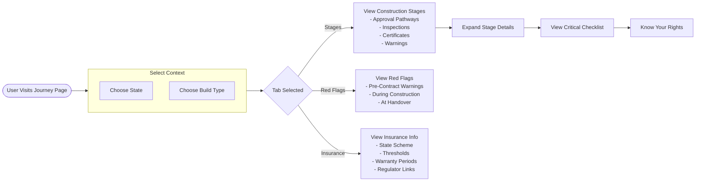

# HomeOwner Guardian - User Workflows

## Project Lifecycle

---

## Project Creation Flow

---

## Checklist Completion Flow

---

## Variation Approval Flow

---

## Certification Gate Flow

---

## Report Generation Flow

---

## Fair Trading Dispute Flow

---

## Build Journey Learning Flow

